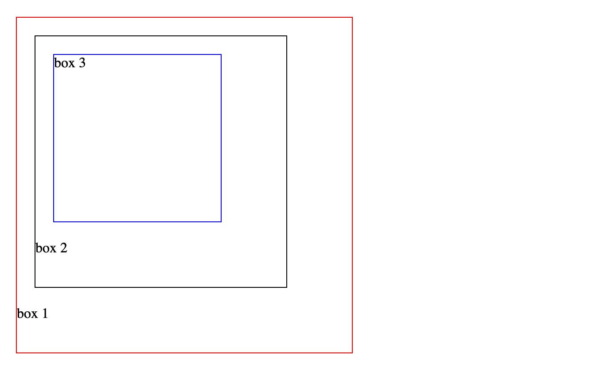
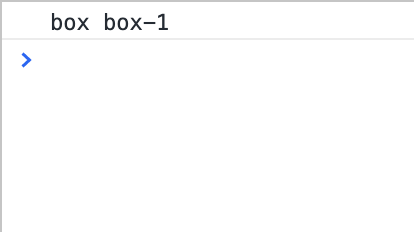

Khi xử lý với Event thông qua DOM ở trong Javascript, cần phải hiểu một chút kỹ càng về cách các event hoạt động. Mỗi khi một event được **trigger**, bắt đầu thực thi **listener** thì cùng lúc cũng có nhiều **listener** được kích hoạt cùng lúc. Có các cơ chế để trình duyệt thực hiện những **listener** theo một thứ tự xác định. Các cơ chế cơ bản đó là bubble & capturing.

Xem xét các ví dụ sau đây về độ sâu (depth) của cây DOM thông qua đoạn HTML

```html
<div class="box box-1">
    <div class="box box-2">
        <div class="box box-3">

        </div>
    </div>
</div>
```

```css
*{
    margin: 0;
    padding: 0;
    box-sizing: border-box;
}
.box {
    display: block;
    margin:20px;
}

.box.box-1{
    width: 40vh;
    height: 40vh;
    border: solid 1px red;
}

.box.box-2{
    width: 30vh;
    height: 30vh;
    border: solid 1px black;

}
.box.box-3{
    width: 20vh;
    height: 20vh;
    border: solid 1px blue;

}
```

Khi hiển thị trên trình duyệt thì kết quả sẽ gồm 3 hình vuông lớn nhỏ theo kích thước và thứ tự sau:


Box 3 - nằm trong Box 2 - nằm trong Box 1. Sử dụng một chút logic thì ta cũng có thể nhận thấy rằng khi người dùng click vào Box 3 thì cũng là người dùng click vào Box 2 và Box 1 (bởi vì Box 2 và Box 1 có kích thước lớn hơn và Box 3 nằm ở bên trong)

Nếu chúng ta thêm các **listener** vào event click, thì khi event được trigger ở Box 3 thì các **listener** ở Box 2, Box 1 cũng được trigger theo. Và kết quả là cả 3 **listener** đều được thực thi. Điều này đúng với logic căn bản, tuy nhiên nếu các **listener** này xung đột lẫn nhau (ví dụ ẩn/hiện các component thì không hợp lý chút nào ). Cần nắm rõ cơ chế lan truyền - propagation - các event.

Có 2 cơ chế lan truyền chính của các trình duyệt hiện tại là bubble & capture. Nhiều trình duyệt đã chuyển sang cơ chế mặc định là bubbles - từ "dưới lên "trên". Còn cơ chế capture sẽ ngược lại, từ "trên" xuống "dưới".

Đối với cơ chế capture: trình duyệt sẽ bắt đầu từ gốc của cây DOM, tìm dần xuống tới element được kích hoạt (Box 3). Để tới được Box 3 thì phải trải qua các Node sau : html -> body -> box 1 -> box 2 -> box 3. Như vậy theo cách duyệt cây này thì các **listener** sẽ được trigger theo thứ tự trên (nếu đã được định nghĩa). Còn cơ chế bubble sẽ thực hiện ngược lại, từ node lá duyệt ngược lên gốc: box 3 -> box 2 -> box 1 -> body -> html. Và các **listener** sẽ được kích hoạt với thứ tự trên.

Mặc định các trình duyệt hiện đại đều sử dụng cơ chế bubble. Tuy nhiên ta có thể chỉ định sử dụng cơ chết capture bằng cách sau.
```js
document.querySelectorAll('.box').forEach(element => {
    element.addEventListener("click", function (){
        console.log(this.classList.value)
    })
})
// bubbles
```

```js
document.querySelectorAll('.box').forEach(element => {
    element.addEventListener("click", function() {
        console.log(this.classList.value)
    }, { capture: true })
})
// capture
```


Tuy nhiên đôi khi chúng ta cần ngăn chặn sự lan truyền (tức là chỉ kích hoạt những listener phía trước để đảm bảo đúng dữ kiện ) bằng cách sử dụng phương thức **Event.stopPropagation()**
```js
document.querySelectorAll('.box').forEach(element => {
    element.addEventListener("click", function(event) {
        console.log(this.classList.value)
        event.stopPropagation()
    },
    {
        // capture:true
    }
    )
})
```




Wednesday 31/03/2021

