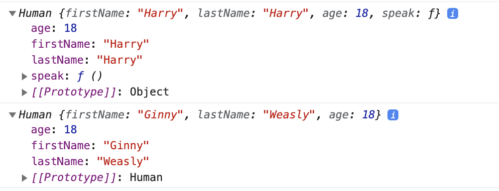
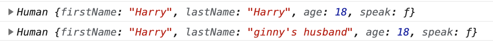

# Javascript & OOP
Trước khi trình bày cụ thể về cách mà Javascript triển khai OOP, các bạn có thể tham khảo bài viết trước của mình có trình bày sơ bộ về các cách triển khai OOP (gồm class-based & prototype-based)

Vốn dĩ từ ban đầu Javascript được tạo ra với mục đích chính là hướng mọi người tới với Functional Programming, nên trong những phiên bản đầu tiên của Javascript thì không có khái niệm class (vì Javascript đâu có phải Java), nhưng vật đổi sao dời thì những nhà phát triển đã nhận ra OOP là một **phát minh quan trọng không thể thay thế**. Nên các nhà phát triển Javascript đã dần dần cài đặt thêm các chức năng hỗ trợ **hướng đối tượng** vào Javascript. Để giữ tình mềm dẻo, linh hoạt của Javascript thì sự lựa chọn Prototype là an toàn nhất.

# Everything is Object
Có một câu nói về Javascript thế này : "Everything is an object, or a primitive". Về cơ bản thì mọi thứ ở trong Javascript đều là object (object trong object oriented programming), ngoại trừ một vài thứ khác như là: number, strings, null, undefined, boolean, symbols.

Để hiểu một cách đơn giản thì object trong Javascript giống như một hash map, một key-value pair. Chúng ta có thể truy cập đến value thông qua một key unique. Chúng ta có thể dễ dàng truy cập tới các phần tử mà object lưu trữ thông qua key và dot notation (toán tử .)

# Encapsulation 
Nói về hướng đối tượng, tính đóng gói được đặt lên hàng đầu đối với các ngôn ngữ định hướng đối tượng. Tuy nhiên Javascript làm điều này rất linh hoạt và loosely (lỏng lẻo). Với Java, tính đóng gói được thể hiển ở việc định nghĩa một class.

```java
public class Human {
    private String firstName;
    private String lastName;
    private int age;
    constructor(String firstName,String lastName,int age){
        this.firstName = firstName;
        this.lastName = lastName;
        this.age = age;
    }

    public void speak(){
        System.out.println('I am Human');
    }
}
```
Một object được tạo ra từ class Human sẽ chỉ có quyền truy cập tới những attributes & method có access modifier là public mà thôi. Còn đối với Javascript thì khái niệm access modifier có lẽ là không tồn tại, bởi vì: 
- Everything is objet
- Everykey in object is public

Đối với Javascript, ta có thể gọi class là một template thì chính xác hơn là một class, chúng ta có thể khai báo một template theo 2 cách.
```js 
function createHuman(firstName,lastName,age){
    let obj = {}
    obj.firstName = firstName
    obj.lastName = firstName
    obj.age = age
    obj.speak = function (){
        console.log(`I am Human, you can call me ${obj.firstName}`)
    }
    return obj
}
```
Tuy nhiên cách này lại có vẻ mất tự nhiên và hơi dài dòng, thay vào đó Javascript cũng hỗ trợ phiên bản xịn xò hơn để có thể ít viết code lại nhờ vào từ khoá `this` và toán tử `new` đi kèm với tên của class được viết hoa chữ cái đầu (mà không phải sử dụng tên hàm). Lúc này thì chúng ta có thể xem đây là một constructor (Javascript còn có cả từ khoá `class`)
```js 
function Human(firstName,lastName,age){
    this.firstName = firstName
    this.lastName = firstName
    this.age = age
    this.speak = function (){
        console.log(`I am Human, you can call me ${this.firstName}`)
    }
}
let human = new Human('Harry','Potter',18)
let human_ex = new Human('Hermione','Granger',18)
human.speak()
human_ex.speak()
// I am Human, you can call me Harry
// I am Human, you can call me Hermione
```
Cách thứ 2 là sử dụng thực thể tối thượng là `Object` và phương thức `create` (chúng ta sẽ gọi đây là một `clone`, gần gần giống như kế thừa)
```js
let human_wife = Object.create(human)
human_wife.firstName = 'Ginny'
human_wife.lastName = 'Weasly'
human_wife.age = 18
console.log(human)
console.log(human_wife)
```

Thứ chúng ta nhận được ở console là



trông có vẻ là đúng nhưng mà speak của `human_wife` lại biến mất đâu rồi, còn `[[Prototype]]` là cái gì nữa vậy nhỉ? 

# Prototype 
Prototype là có thể hiểu là một cơ chế phân cấp, để quản lý các method của object. Giả sử khi mình gọi một method của một object, method này không tồn tại trong object hiện tại, thì object này sẽ tìm cách đưa yêu cầu lên cấp cao hơn tìm kiếm method có tên đó. Giống như khi bạn bị đánh, bạn đánh không lại người ta, bạn sẽ gọi anh của bạn, anh của bạn vẫn đánh không lại, thì anh của bạn sẽ gọi một ông anh nào đó nữa để giành lại công bằng cho bạn, và câu chuyện gọi hội sẽ tiếp tục đến khi không còn ai để gọi (đã gọi đến cấp cao nhất mà vẫn không có method đó). Prototype là cơ chế phân cấp như vậy. Việc truy xuất các phần tử (có thể là attribute & method ) dựa theo một quy tắc là prototype chain cho phép truy xuất các phần tử dần dần từ cấp bậc thấp đến cấp bậc cao - cao nhất là Object.

Object có thể truy xuất tới prototype của cấp lớn hơn thông qua key `__proto__`. Tất cả các thuộc tính được kế thừa đều nằm ở trong `__proto__ object`. Lấy ví dụ cũ, chúng ta sẽ thêm một vài chi tiết và kết quả

```js 
console.log(human)
console.log(human_wife)
console.log(human_wife.__proto__)
```

Điều này đồng nghĩa với việc là `clone object` có khả năng truy cập và chỉnh sửa `original object`

```js
console.log(human)
human_wife.__proto__.lastName = 'ginny\'s husband'
console.log(human)
```



Một điều thú vị là nếu bạn expand bằng việc bấm nút tam giác ngược ở dòng thứ 2 thì sẽ thấy data cũng bị thay đổi theo (vì lúc này trình duyệt sẽ lấy dữ liệu hiện tại của object - đã bị thay đổi)

Javascript cài đặt cơ chế kế thừa thông qua prototype nên cũng tồn đọng vấn đề tương tự. Nhưng trước khi đến với ví dụ về kế thừa thông qua từ khoá `extends` thì mình sẽ giới thiệu về từ khoá `class` trước. Thực ra sử dụng từ khoá `class` đi kèm với `new` thì bản chất ở bên dưới là sử dụng `Object.create`

```js 
class Human {
    constructor(firstName, lastName, age) {
        this.firstName = firstName
        this.lastName = firstName
        this.age = age
    }
    speak = function () {
        console.log(`I am Human, you can call me ${this.firstName}`)
    }
}
```
thì sẽ được thay thế bằng ở phần backgroud (bằng chứng là kết quả khi console 2 object được tạo ra 2 cách giống nhau Prototype cơ bản)

```js
function Human(firstName,lastName,age){
    this.firstName = firstName
    this.lastName = firstName
    this.age = age
    this.speak = function (){
        console.log(`I am Human, you can call me ${this.firstName}`)
    }
}
// lưu ý nếu chúng ta sử dụng cách này chúng ta đang khai báo prototype của function thay vì khai báo như method - cách trên
// Human.prototype.speak = function (){
//     console.log(`I am Human, you can call me ${this.firstName}`)
// }
```

Có thể một vài điều khó hiểu là tại sao mình khi thì dùng `__proto__` và khi thì dùng `prototype`. 2 cách này đều được sử dụng nhằm mục đích truy cập vào `prototype` của một object. Tuy nhiên `__proto__` sử dụng với mục đích truy cập `prototype` của object gốc (object được clone sẽ sử dụng `__proto__` để truy cập tới `prototype` của `object` có bậc cao hơn - gọi anh xã hội). Còn `prototype` thì sử dụng để định nghĩa các `prototype` của `class` (chính xác hơn là `constructor function`) hiện tại. Xét thử ví dụ sau

```js
function Human(firstName,lastName,age){
    this.firstName = firstName
    this.lastName = firstName
    this.age = age
}
// works
Human.prototype.speak =function (){
    console.log(`I am Human, you can call me ${this.firstName}`)
}
let human_wife = Object.create(human)
human_wife.firstName = 'Ginny'
human_wife.lastName = 'Weasly'
human_wife.age = 18
// bug, err eh ?
human_wife.prototype.saylove = function (){
    console.log(`I am ${this.firstName}, in love with u!`)
}
```

Điều cần chú ý là `prototype` là một `property` của một function, còn `__proto__` là `property` của `object`. Mọi thứ có trong `prototype` của một `constructor function` sẽ được nhân bản tự động và copy khi từ khoá `new` được gọi (`function` không chỉ đơn giản là `function`, mà là `constructor function`, nếu gọi `function` mà không có từ khoá `new` thì kết quả trả về là `undefined`, như ví dụ đã đề cập ở trước). Chúng có thể sử dụng thực thể tối thượng là `Object` để có quyền chỉnh sửa `prototype`. 

```js
Object.setPrototypeOf(human_wife, {
    saylove: function () {
        console.log(`I am ${this.firstName}, in love with u!`)
    }
})
human_wife.saylove()
// bug, err eh ?
human_wife.speak()
```

Và lúc này thì prototype được copy từ `human` đã bị replace hoàn toàn, chúng ta có thể giữ lại bằng viêc sử dụng rest operator (...)


# Conclusion
Tóm lại, `prototype` khác với `property`, khi chúng ta sử dụng `dot notation` (.) thì javascript sẽ dựa vào cơ chế `prototype chain` để lookup giá trị. Về bản chất `prototype` là một `object`, chứa thông các `property` đã được xác định trước. Chúng ta có thể khai báo `prototype` thông qua `func.prototype`. Khi khởi tạo một `object`, `object` sẽ có quyền truy cập tới `prototype` của object gốc (thông thường là Object). Nếu sử dụng `Objet.create`, thì object truyền vào hàm `object` chính là `prototype`. Chúng ta có thể truy cập tới `prototype` của object gốc thông qua `property` là `__proto__`. Javascript khiến cho việc sử dụng OOP rất linh hoạt, dễ dàng , không cứng nhắc như Java, nhưng đồng thời cũng có những bất lợi là quà tặng kèm. Từ phiên bản ECMA2015 thì Javascript đã hỗ trợ các từ khoá như `class`,`super`,`constructor`, `extends` ,... để giúp viết code hướng đối tượng dễ dàng hơn (thay vì sử dụng `Object.create`)

---

# References & more resources
- https://developer.mozilla.org/en-US/docs/Learn/JavaScript/Objects/Object-oriented_JS
- https://kipalog.com/posts/prototype-la-khi-gi-
- https://developer.mozilla.org/en-US/docs/Web/JavaScript/Inheritance_and_the_prototype_chain

### P/S:
Nếu có gì sai sót xin gửi email cho mình để cập nhật, xin cảm ơn!
